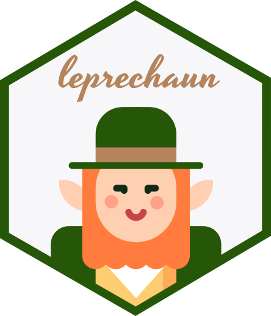

<div align="center">

<!-- badges: start -->
<!-- badges: end -->



[Quick Start](https://leprechaun.opifex.org/#/guide/quick-start) | [Docs](https://leprechaun.opifex.org)

Leprechaun allows you to generate _lean_ and _robust_ 
[shiny](http://shiny.rstudio.com/) applications.

</div>

## Get it

Leprechaun is not yet on CRAN, get it from Github.

``` r
# install.packages("remotes")
remotes::install_github("devOpifex/leprechaun")
```

## Basics

From the root of a package scaffold a leprechaun application.

``` r
usethis::create_package("myApp")
leprechaun::scaffold()
```

This effectively generates code within the package to run a 
shiny application within a package: leprechaun _does not_ 
become a dependence to your project.
